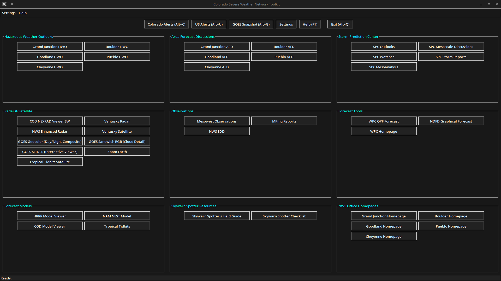

# Colorado Severe Weather Network Toolkit



## 🌀 Overview

**Colorado Severe Weather Network Toolkit** is a streamlined, GUI-based application designed to provide quick access to critical weather tools, forecasts, and radar products specific to Colorado and nearby regions. It aggregates links and resources from the National Weather Service (NWS), Storm Prediction Center (SPC), and other weather platforms to assist meteorologists, storm spotters, emergency managers, and weather enthusiasts in severe weather monitoring and preparedness.

---

## 🧰 Features

- **Hazardous Weather Outlooks**  
  One-click access to HWO pages for Grand Junction, Boulder, Pueblo, Cheyenne, and Goodland offices.

- **Area Forecast Discussions (AFDs)**  
  Quickly view detailed forecast discussions from multiple NWS offices.

- **Storm Prediction Center (SPC) Resources**  
  - SPC Outlooks  
  - Mesoscale Discussions  
  - Watches & Warnings  
  - Storm Reports  
  - Mesoanalysis

- **Radar & Satellite Tools**  
  - NEXRAD Radar (COD, NWS Enhanced, etc.)  
  - GOES Satellite Viewers (RGB Cloud Detail, SLIDER, Zoom Earth)  
  - Ventusky Radar & Satellite  
  - Tropical Tidbits

- **Observations**  
  - Mesowest Observations  
  - MPing Reports  
  - NWS EDD

- **Forecast Tools**  
  - WPC QPF Forecast  
  - NDFD Graphical Forecast  
  - WPC Homepage

- **Forecast Models**  
  - HRRR, NAM NEST, COD, and Tropical Tidbits

- **Skywarn Spotter Resources**  
  - Field Guide  
  - Spotter Checklist

- **NWS Office Homepages**  
  - Quick access to individual office websites

---

## 🚀 Getting Started

### Prerequisites

- Python 3.x  
- `tkinter` (usually preinstalled with Python)
- `requests`
- `beautifulsoup4`
- `pillow`
- Internet connection (for live web links)

### Installation (Source Code)

```bash
git clone https://github.com/<your-username>/Colorado-Severe-Weather.git
cd Colorado-Severe-Weather
python3 Colorado-SWN.py
```

> Or run the compiled executable: `Colorado-SWN.exe` (Windows)

---

## 📸 Interface Preview

Screenshots of the toolkit in action:

- Main Menu: `CSWN.png`
- GOES Viewer: `CSWN-GOES-load.png`
- SPC Browser: `CSWN-SPC-Browser.png`
- AFD Tool: `CSWN-AFD.png`
- HWO Tool: `CSWN-HWO.png`
- Additional Views: `CSWN-GEOS.png`, `CSWN-SPC-1.png`, `CSWN-SPC.png`

---

## 📂 Directory Structure

```plaintext
Colorado-Severe-Weather/
├── Colorado-SWN.exe
├── Colorado-SWN.py
├── colorado_severe_weather_rounded.ico
├── CSWN.png
├── CSWN-AFD.png
├── CSWN-GEOS.png
├── CSWN-GOES-load.png
├── CSWN-HWO.png
├── CSWN-SPC-1.png
├── CSWN-SPC-Browser.png
├── CSWN-SPC.png
└── README.md
```

---

## 🛠️ Contributing

Pull requests are welcome! If you have suggestions for improvements or new features, feel free to open an issue or fork and submit a PR.

---

## 📄 License

This project is licensed under the MIT License.

---

## 🙏 Acknowledgments

- National Weather Service (weather.gov)  
- Storm Prediction Center (spc.noaa.gov)  
- College of DuPage NEXRAD Tools  
- Mesowest, Ventusky, Zoom Earth  
- Skywarn Spotter program  
