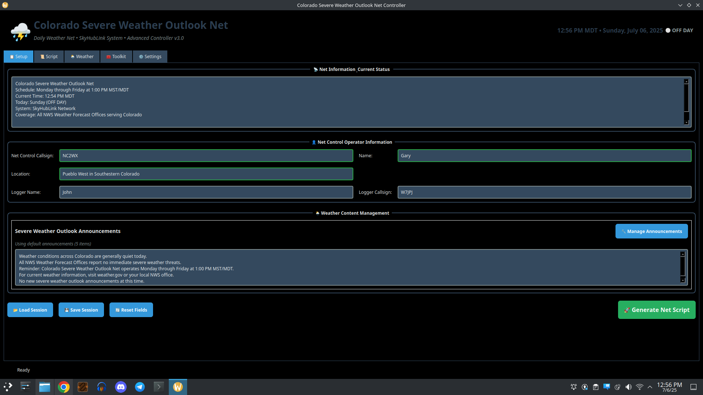
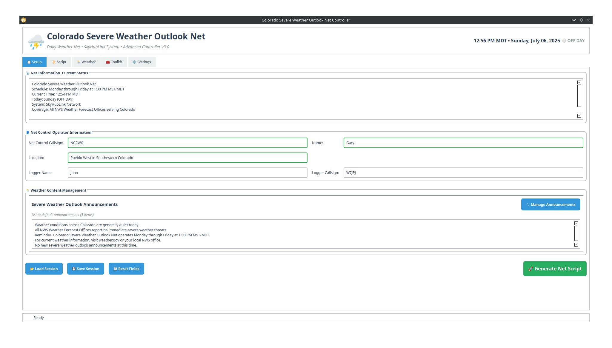
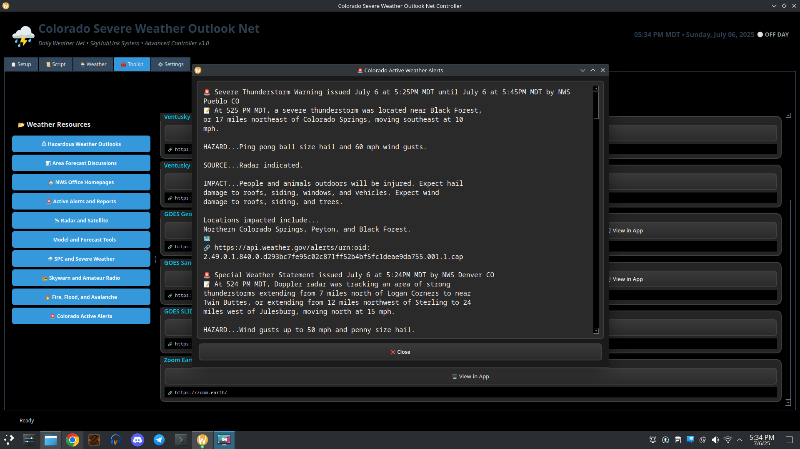
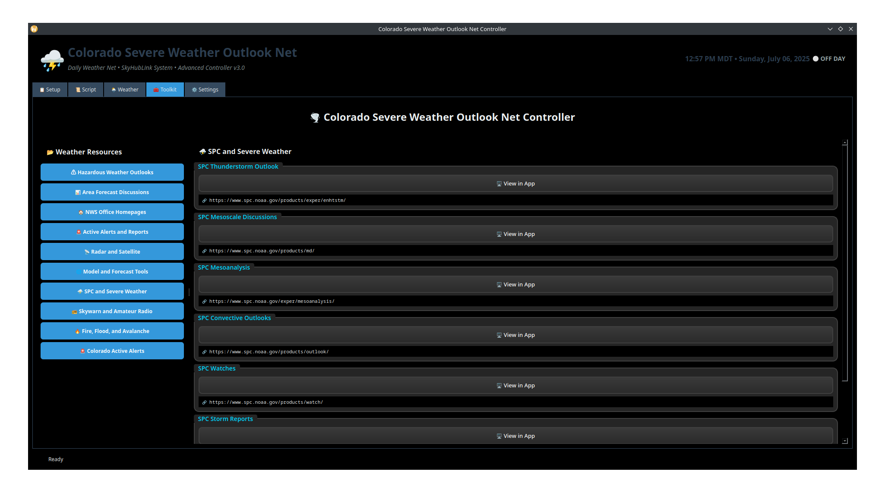
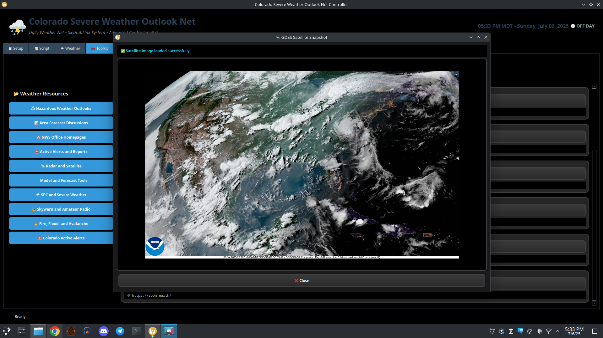
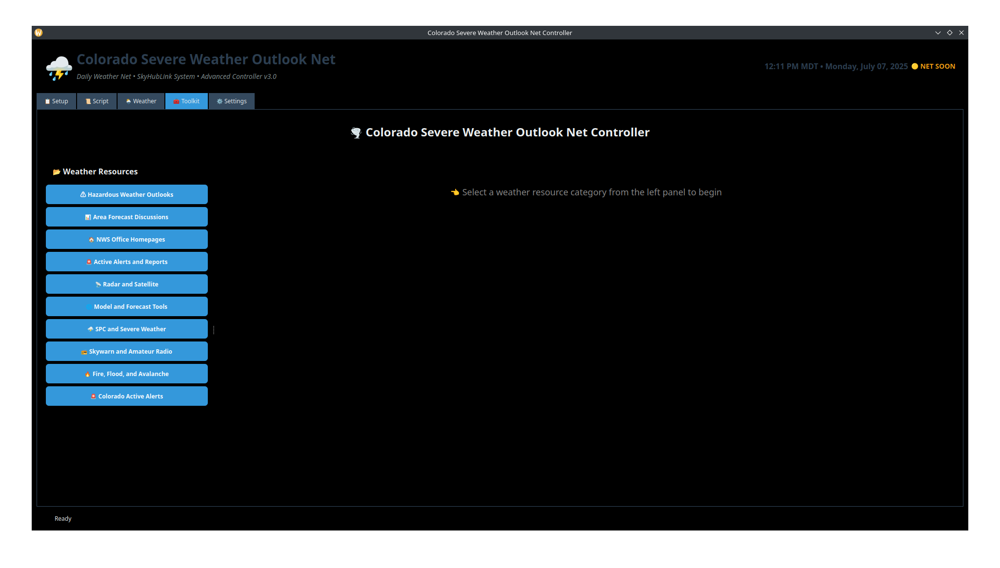

# ⛈️ Colorado Severe Weather Network Toolkit

<div align="center">



**A comprehensive desktop application for severe weather monitoring and emergency communications in Colorado**

[](https://github.com/W5ALC/Colorado-Severe-Weather/releases)
[](LICENSE)
[](https://www.python.org/)
[](https://github.com/W5ALC/Colorado-Severe-Weather/releases)

[**📥 Download Latest Release**](https://github.com/W5ALC/Colorado-Severe-Weather/releases/latest) • [**📖 Documentation**](#-getting-started) • [**🌐 Live Gallery**](https://w5alc.github.io/Colorado-Severe-Weather/)

</div>

---

## 📋 Table of Contents

- [Overview](#-overview)
- [Key Features](#-key-features)
- [Screenshots](#-screenshots)
- [Installation](#-installation)
- [Usage](#-usage)
- [Features in Detail](#-features-in-detail)
- [Contributing](#-contributing)
- [Acknowledgments](#-acknowledgments)
- [License](#-license)

---

## 🌀 Overview

The **Colorado Severe Weather Network Toolkit** is a specialized GUI application designed for meteorologists, storm spotters, emergency managers, and weather enthusiasts operating in Colorado and surrounding regions. It provides centralized access to critical weather resources, real-time data, and forecasting tools from the National Weather Service (NWS), Storm Prediction Center (SPC), and other authoritative sources.

### Why CSWN Toolkit?

- **⚡ Rapid Access** - All critical weather resources in one unified interface
- **🎯 Colorado-Focused** - Tailored for CO's unique weather patterns and NWS offices
- **🔄 Real-Time Updates** - Live weather alerts, radar, and satellite imagery
- **📡 Net Control Ready** - Built-in script generator for amateur radio weather nets
- **🌙 Dark/Light Modes** - Comfortable viewing in any environment
- **🖥️ Cross-Platform** - Windows, macOS, and Linux support

---

## ✨ Key Features

### 🎙️ **Net Control Script Generator**
- Automatically generates daily net control scripts
- Includes AFD and HWO from all 5 partner NWS offices (BOU, PUB, GJT, CYS, GLD)
- Customizable parameters to keep information relevant
- Perfect for ARES/RACES operations

### 🌩️ **Severe Weather Monitoring**
- **Storm Prediction Center Integration**
  - Convective Outlooks (Day 1-8)
  - Mesoscale Discussions
  - Watch/Warning Polygons
  - Storm Reports Archive
  - Mesoanalysis Tools
  
- **Real-Time Alerts**
  - Colorado-specific weather alerts
  - County-level warnings
  - Interactive alert maps

### 🛰️ **Radar & Satellite**
- NEXRAD Radar (Multiple sources)
- GOES-16/19 Satellite Imagery
- RGB Cloud Detail Products
- Zoom Earth Real-Time View
- Ventusky Radar/Satellite
- Tropical Tidbits Integration

### 📊 **Forecast Tools**
- **NWS Products**
  - Area Forecast Discussions (AFD)
  - Hazardous Weather Outlooks (HWO)
  - Graphical Forecasts (NDFD)
  - Weather Prediction Center (WPC)
  
- **Model Data**
  - HRRR (High-Resolution Rapid Refresh)
  - NAM NEST
  - College of DuPage Model Viewers
  - Tropical Tidbits Model Graphics

### 📡 **Observations**
- Mesowest Station Data
- mPing Reports
- NWS Enhanced Data Display (EDD)
- Surface Observations

### 🎓 **Educational Resources**
- Skywarn Spotter Training Materials
- Field Guide Access
- Spotter Checklist
- COMET MetEd Training Links

---

## 📸 Screenshots

<div align="center">

### Main Interface (Dark Mode)


### Main Interface (Light Mode)


<table>
  <tr>
    <td><br/><b>Active Alerts</b></td>
    <td><br/><b>SPC Products</b></td>
  </tr>
  <tr>
    <td><br/><b>GOES Satellite</b></td>
    <td><br/><b>Toolkit Tab</b></td>
  </tr>
</table>

[**🖼️ View Full Gallery**](https://w5alc.github.io/Colorado-Severe-Weather/)

</div>

---

## 💾 Installation

### Option 1: Download Pre-Built Executable (Recommended)

Choose your platform from the [**latest release**](https://github.com/W5ALC/Colorado-Severe-Weather/releases/latest):

#### 🪟 **Windows**
```bash
# Download and extract
CSWN-Toolkit-v3.1.0-windows.zip

# Run the executable
CSWN-toolkit.exe
```

#### 🍎 **macOS**
```bash
# Download the DMG
CSWN-Toolkit-v3.1.0-macos.dmg

# Install and run
```

#### 🐧 **Linux**
```bash
# Download and extract
tar -xzf CSWN-Toolkit-v3.1.0-linux.tar.gz

# Make executable
chmod +x CSWN-Toolkit-linux-x86_64

# Run
./CSWN-Toolkit-linux-x86_64

# Or use AppImage (if available)
chmod +x CSWN-Toolkit-*.AppImage
./CSWN-Toolkit-*.AppImage
```

### Option 2: Run from Source

#### Prerequisites
- Python 3.8 or higher
- Internet connection

#### Installation Steps

```bash
# Clone the repository
git clone https://github.com/W5ALC/Colorado-Severe-Weather.git
cd Colorado-Severe-Weather

# Install dependencies
pip install -r requirements.txt

# Run the application
python3 Colorado-Severe-Weather.py
```

#### Required Python Packages
```
PyQt6
PyQt6-WebEngine
requests
beautifulsoup4
pillow
```

---

## 🚀 Usage

### First Launch

1. **Launch the application** using your preferred method
2. **Explore the tabs** to familiarize yourself with available resources
3. **Check the alerts** tab for any active Colorado weather alerts
4. **Generate a net script** if conducting weather net operations

### Quick Start Guide

#### For Storm Spotters
1. Navigate to **"SPC & Severe"** tab for convective outlooks
2. Check **"Alerts"** for active warnings in your area
3. Use **"Radar/Satellite"** for real-time storm tracking
4. Access **"Skywarn Resources"** for field guide and checklist

#### For Net Control Operators
1. Open the **"Toolkit"** tab
2. Click **"Generate Net Script"**
3. Script includes current AFD and HWO from all CO NWS offices
4. Customize parameters as needed for your net

#### For Forecasters
1. Review **"AFD"** tab for detailed forecast discussions
2. Check **"HWO"** for hazardous weather outlooks
3. Analyze **"Models"** tab for HRRR and other model data
4. Monitor **"Observations"** for current conditions

### Keyboard Shortcuts

- `Ctrl+R` - Refresh current view
- `Ctrl+D` - Toggle dark/light mode
- `Ctrl+Q` - Quit application
- `F11` - Toggle fullscreen

---

## 🔧 Features in Detail

### Net Control Script Generator

The script generator creates professional, organized net control scripts including:

- **Date and time** automatically populated
- **Current weather alerts** for Colorado
- **Area Forecast Discussions** from:
  - Boulder (BOU)
  - Pueblo (PUB)
  - Grand Junction (GJT)
  - Cheyenne (CYS)
  - Goodland (GLD)
- **Hazardous Weather Outlooks** from all offices
- **Customizable sections** for your specific net requirements

### Multi-Office Coverage

CSWN Toolkit covers all NWS offices serving Colorado:

| Office | Coverage Area | Callsign |
|--------|---------------|----------|
| Boulder | North Central CO | BOU |
| Pueblo | Southeast CO | PUB |
| Grand Junction | Western CO | GJT |
| Cheyenne | Northeast CO | CYS |
| Goodland | Eastern Plains | GLD |

### Real-Time Data Sources

- **NWS API** - Official weather alerts and forecasts
- **SPC** - Severe weather outlooks and discussions
- **GOES-R** - Latest satellite imagery
- **NEXRAD** - Real-time radar data
- **Mesowest** - Surface observations

---

## 🤝 Contributing

Contributions are welcome! Here's how you can help:

### Reporting Issues

1. Check if the issue already exists in [Issues](https://github.com/W5ALC/Colorado-Severe-Weather/issues)
2. Create a new issue with:
   - Clear description of the problem
   - Steps to reproduce
   - Expected vs actual behavior
   - Screenshots if applicable
   - Your OS and Python version

### Submitting Changes

1. Fork the repository
2. Create a feature branch (`git checkout -b feature/AmazingFeature`)
3. Commit your changes (`git commit -m 'Add some AmazingFeature'`)
4. Push to the branch (`git push origin feature/AmazingFeature`)
5. Open a Pull Request

### Development Setup

```bash
# Clone your fork
git clone https://github.com/YOUR_USERNAME/Colorado-Severe-Weather.git

# Create virtual environment
python -m venv venv
source venv/bin/activate  # On Windows: venv\Scripts\activate

# Install development dependencies
pip install -r requirements.txt
pip install pytest pylint black

# Run tests
pytest tests/

# Format code
black *.py
```

---

## 🙏 Acknowledgments

This project wouldn't be possible without these excellent resources:

### Data Providers
- **[National Weather Service](https://weather.gov)** - Weather forecasts, alerts, and data
- **[Storm Prediction Center](https://spc.noaa.gov)** - Severe weather outlooks and analysis
- **[College of DuPage](https://weather.cod.edu)** - NEXRAD radar and model visualizations
- **[NOAA GOES](https://www.goes.noaa.gov/)** - Satellite imagery
- **[Mesowest](https://mesowest.utah.edu/)** - Surface observations
- **[Tropical Tidbits](https://tropicaltidbits.com)** - Model graphics and analysis

### Tools & Libraries
- **PyQt6** - Cross-platform GUI framework
- **Beautiful Soup** - HTML parsing
- **Requests** - HTTP library

### Organizations
- **[Skywarn](https://www.weather.gov/skywarn/)** - Storm spotter program
- **[ARES/RACES](http://www.arrl.org/ares)** - Amateur radio emergency services
- **Colorado Amateur Radio Community** - Testing and feedback

---

## 📄 License

This project is licensed under the **"It's Not That Serious" v1 License**.

In plain English: Feel free to use, modify, and distribute this software. No warranties provided. Don't blame me if something breaks. Attribution appreciated but not required.

---

## 📞 Contact & Support

- **Issues/Bugs**: [GitHub Issues](https://github.com/W5ALC/Colorado-Severe-Weather/issues)
- **Discussions**: [GitHub Discussions](https://github.com/W5ALC/Colorado-Severe-Weather/discussions)
- **Callsign**: W5ALC
- **Email**: Available on QRZ.com

---

## 🗺️ Roadmap

### Upcoming Features
- [ ] Push notifications for severe weather alerts
- [ ] Historical storm report database
- [ ] Integration with ham radio logging software
- [ ] Mobile companion app
- [ ] Offline mode with cached data
- [ ] Custom alert zones and filters
- [ ] APRS integration for storm spotters

### Version History
- **v3.1.0** (Current) - Enhanced UI, added GOES-19 support
- **v3.0.0** - Major rewrite with PyQt6, dark mode
- **v2.1.0** - Added net script generator
- **v2.0.0** - Multi-platform support
- **v1.0.0** - Initial release

See [CHANGELOG.md](CHANGELOG.md) for detailed version history.

---

## ⭐ Star History

If you find this project useful, please consider giving it a star! It helps others discover the tool.

[](https://star-history.com/#W5ALC/Colorado-Severe-Weather&Date)

---

<div align="center">

**Made with ⚡ by W5ALC for the Colorado weather community**

[Report Bug](https://github.com/W5ALC/Colorado-Severe-Weather/issues) • [Request Feature](https://github.com/W5ALC/Colorado-Severe-Weather/issues) • [View Gallery](https://w5alc.github.io/Colorado-Severe-Weather/)

</div>
